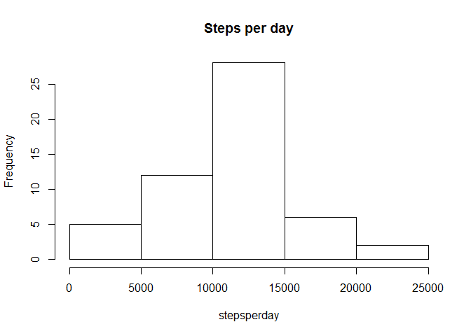
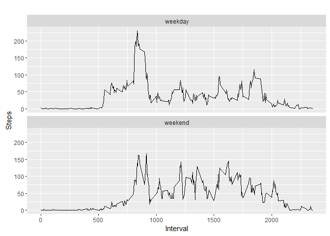

# Reproducible Research: Peer Assessment 1

## Loading and preprocessing the data


```r
rawdata <- read.csv("activity.csv")
library(data.table)
data <- data.table(rawdata)
```

## What is mean total number of steps taken per day?


```r
newdata <- data[complete.cases(data), ]
```

```r
stepsperday <- as.numeric()
for (date in unique(newdata$date)) {
  stepsperday <- c(stepsperday, sum(newdata$steps[newdata$date == date]))
}
```

```r
hist(stepsperday, main = "Steps per day")
```



```r
mean(stepsperday)
```

```
## [1] 10766.19
```

```r
median(stepsperday)
```

```
## [1] 10765
```

## What is the average daily activity pattern?


```r
avsteps <- aggregate(steps ~ interval, newdata, mean)
plot(avsteps$interval, avsteps$steps, type="l", xlab = "interval", ylab = "steps")
```


```r
avsteps[which.max(avsteps$steps), ]
```

```
##     interval    steps
## 104      835 206.1698
```

## Imputing missing values


```r
sum(is.na(data))
```

```
## [1] 2304
```

```r
for (i in 1:nrow(data)) {
  if (is.na(data$steps[i])){
    int <- data$interval[i]
    row <- which(avsteps$interval == int)
    data$steps[i] <- avsteps$steps[row]
  }
}
```

```r
stepsperday2 <- as.numeric()
for (date in unique(newdata$date)) {
  stepsperday2 <- c(stepsperday2, sum(newdata$steps[newdata$date == date]))
}
hist(stepsperday2, main = "Steps per day")
```


```r
mean(stepsperday2)
```

```
## [1] 10766.19
```

```r
median(stepsperday2)
```

```
## [1] 10765
```
The mean is the same with or without missing values.
The median differs a very little.
By filling the missing values with the mean for intervals, the impact is practically unnoticeable.

## Are there differences in activity patterns between weekdays and weekends?

```r
data$date <- as.character(data$date)
data$day <- weekdays(as.Date(data$date))
for (i in 1:nrow(data)) {
  if(data$day[i] == "sábado" || data$day[i] == "domingo"){
    data$day[i] <- "weekend"
  } else{
    data$day[i] <- "weekday"
  }
}
avsteps2 <- aggregate(steps ~ interval+day, data, mean)
library(ggplot2)
```

```
## Warning: package 'ggplot2' was built under R version 3.2.4
```

```r
qplot(interval, steps, data=avsteps2, geom=c("line"), xlab="Interval", ylab="Steps", main="") + facet_wrap(~ day, ncol=1)
```


